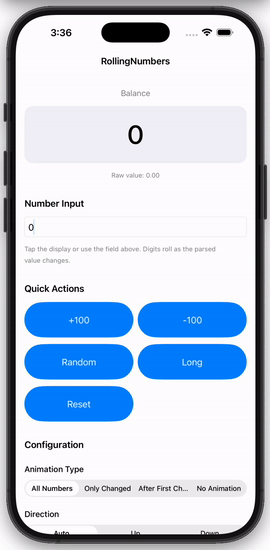

# RollingNumbers (SwiftUI)

SwiftUI rolling number animation for iOS, iPadOS, macOS, tvOS, and watchOS.

This is a **SwiftUI port** of the original UIKit library by [Max Kalik](https://github.com/maxkalik). Each digit rolls smoothly into place whenever the displayed value changes.



## Supported platforms

| Platform | Minimum version |
|----------|-------------------|
| iOS / iPadOS | 15.0+ |
| macOS | 12.0+ |
| tvOS | 15.0+ |
| watchOS | 8.0+ |

## Requirements

- Xcode 15+
- Swift 5.9+

## Installation

### Swift Package Manager

In Xcode, choose **File → Add Packages…** and enter your repository URL:

```
https://github.com/VannhengChang/RollingNumbers-SwiftUI.git
```

Or add the dependency to your `Package.swift`:

```swift
.package(url: "https://github.com/VannhengChang/RollingNumbers-SwiftUI.git", from: "1.0.0")
```

Then add `RollingNumbers` to your target dependencies.

## Demo app

An interactive demo lives in [`Demo/`](Demo/README.md).

1. Open `Demo/RollingNumbersDemo/RollingNumbersDemo.xcodeproj` in Xcode.
2. Run on an iOS Simulator, iPad Simulator, or **My Mac**.

The demo links to the local Swift package at the repository root.

## Usage

`RollingNumbersView` is a declarative SwiftUI view. Pass any `Double` and the view animates whenever the value changes.

```swift
import SwiftUI
import RollingNumbers

struct ContentView: View {
    @State private var balance: Double = 0

    var body: some View {
        VStack(spacing: 24) {
            RollingNumbersView(number: balance)
                .rollingFont(size: 48, weight: .medium)
                .rollingTextColor(.primary)
                .rollingAnimationType(.allAfterFirstChangedNumber)
                .rollingDirection(.up)

            Button("Randomize") {
                balance = Double.random(in: 0...9999.99)
            }
        }
        .padding()
    }
}
```

## Configuration

All configuration uses chainable view modifiers:

```swift
RollingNumbersView(number: balance)
    .rollingAnimationType(.onlyChangedNumbers)
    .rollingDirection(.up)
    .rollingAlignment(.center)
    .rollingCharacterSpacing(1)
    .rollingFont(size: 48, weight: .medium)
    .rollingTextColor(.primary)
    .rollingFormatter(currencyFormatter)
    .rollingAnimationConfiguration(
        .init(duration: 1, speed: 0.3, damping: 17, initialVelocity: 1)
    )
    .rollingOverflowMode(.scaleToFit)
    .onRollingAnimationComplete {
        // called after each rolling animation finishes
    }
```

### Animation type

| Type | Description |
|------|-------------|
| `allNumbers` | All digits roll if even one digit changes |
| `onlyChangedNumbers` | Only changed digits roll |
| `allAfterFirstChangedNumber` | All digits at and after the first changed digit |
| `noAnimation` | Digits change without animation |

### Animation direction

| Type | Description |
|------|-------------|
| `up` | Digits roll from bottom to top |
| `down` | Digits roll from top to bottom |

When `rollingDirection` is unset, the direction is chosen automatically based on whether the new number is greater or smaller than the previous one.

## Migrating from the UIKit version

The original UIKit API used imperative methods such as `setNumber(_:)` and `setTextColor(_:withAnimationDuration:)`. In SwiftUI, update the value bound to `RollingNumbersView`:

```swift
@State private var number: Double = 0

RollingNumbersView(number: number)
    .rollingTextColor(textColor)
    .animation(.easeInOut, value: textColor)
```

See the [original UIKit library](https://github.com/maxkalik/RollingNumbers) for reference.

## Credits

- **Original UIKit implementation:** [Max Kalik](https://github.com/maxkalik) — [RollingNumbers](https://github.com/maxkalik/RollingNumbers)
- **SwiftUI multi-platform port:** [Vannheng Chang](https://github.com/VannhengChang)

If you use this library, please credit the original author and this SwiftUI adaptation.

## License

Released under the [MIT](LICENSE) license.

Copyright (c) 2023 Max Kalik  
Copyright (c) 2025 Vannheng — SwiftUI multi-platform port
